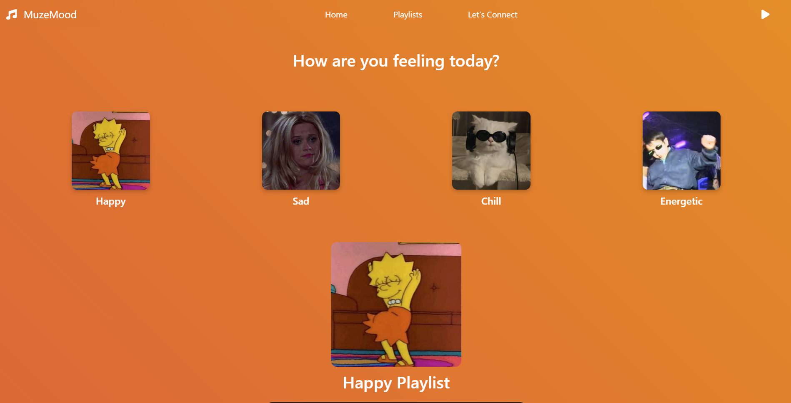
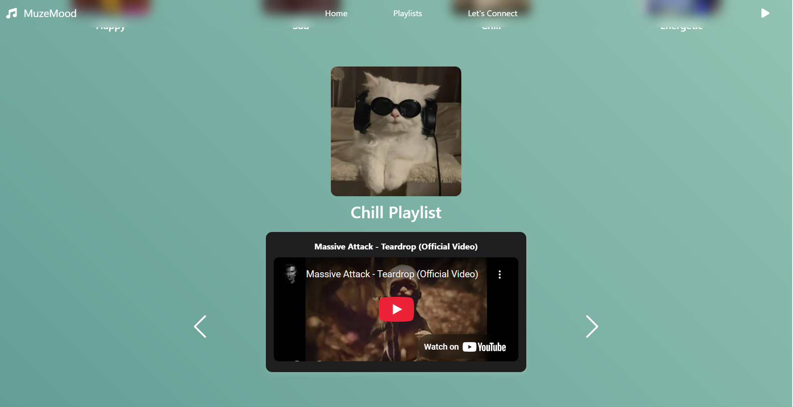

# 📌 Project Overview

MuzeMood is a dynamic music discovery website that integrates the OpenWhyd API to curate playlists based on user-selected moods. 
The website offers a visually engaging experience with animated backgrounds, seamless YouTube video playback and interactive playlist navigation using Swiper.js.

## Features

Mood-Based Playlists 🎼 → Users can select a mood (Happy, Sad, Chill, Energetic) to generate a playlist.

Dynamic UI Updates ✨ → Backgrounds and UI elements change based on mood selection.

YouTube Video Playback ▶️ → Embedded YouTube videos for a seamless music experience.

Swiper.js Integration 🔄 → Smooth navigation through songs in a playlist.

Live API Data Fetching 🔗 → Retrieves music playlists from OpenWhyd using Axios.

Song Submission Form 🎤 → Users can submit YouTube song links for playlist consideration

Error Handling 🛠 → Displays user-friendly messages when API errors occur

## 🛠 Tech Stack

Frontend: HTML, CSS, Bootstrap, JavaScript, Swiper.js

Backend: Node.js, Express.js, EJS (templating engine)

API Integration: OpenWhyd API, Axios

Hosting: Render

OpenWhyd API Usage

Retrieves music playlists categorized by mood.

Filters track data and embeds YouTube videos.

Uses Axios for GET requests to fetch playlists dynamically.

## 📜 License

This project is for educational purposes only and built as part of The App Brewery Full-Stack Web Development course by Dr Angela Yu hosted on Udemy. 
Some images are sourced from Freepik and Pinterest and require proper attribution.

## 👩🏽‍💻 Author

Developed by Rida Siddique.

## Project objectives

The goal of this project was to build a website using the express/node.js platform, with the Axios HTTP client that integrates a chosen public API, preferably one that does not require authentication and is CORS enabled. 

The website should interact with the chosen API, retrieve data and present it in a user-friendly manner.

-Develop an understanding of how to integrate public APIs into web projects.

-Gain practical experience using Express/Node.js for server-side programming.

-Enhance understanding of client-server communication using Axios.

-Demonstrate ability to manipulate, present and work with data retrieved from APIs.
